# PERT Chart: Making a New Codebase

This roadmap outlines the journey from initial requirements to the final production release.

```mermaid
%%{init: { 
  "theme": "base", 
  "flowchart": { "htmlLabels": true, "curve": "step", "rankSpacing": 100, "nodeSpacing": 60 }, 
  "themeVariables": { "fontFamily": "Inter, system-ui, sans-serif", "fontSize": "18px" } 
}}%%
flowchart LR

    %% --- ENDPOINTS ---
    S(("🏁<br/>START")):::endpoint
    F(("🚀<br/>RELEASE")):::endpoint

    %% --- PHASE 1: FOUNDATION ---
    subgraph Foundation ["PHASE 1: FOUNDATION"]
        direction LR
        REQ(["📋 Requirements<br/>(1 Week)"]):::critical
        ARCH(["📐 Architecture<br/>(1 Week)"]):::critical
    end

    %% --- PHASE 2: CORE SYSTEMS ---
    subgraph Core ["PHASE 2: CORE SYSTEMS"]
        direction TB
        DB(["💽 Database<br/>(1 Week)"]):::critical
        API(["⚙️ Core API<br/>(2 Weeks)"]):::critical
        
        %% Side track
        GIT(["🐙 Git & Repo<br/>(1 Day)"]):::side
        ENV(["🏗️ Scaffolding<br/>(3 Days)"]):::side
    end

    %% --- PHASE 3: FRONTEND & UX ---
    subgraph UIUX ["PHASE 3: FRONTEND & UX"]
        direction LR
        UX(["🎨 UI Design<br/>(2 Weeks)"]):::frontend
        FE(["🖥️ Frontend Dev<br/>(3 Weeks)"]):::frontend
    end

    %% --- PHASE 4: QUALITY ---
    subgraph QA_Phase ["PHASE 4: QUALITY CONTROL"]
        direction TB
        INT(["🧩 Integration<br/>(1.5 Weeks)"]):::critical
        QA(["🛡️ System QA<br/>(2 Weeks)"]):::critical
        SEC(["🔐 Security Audit<br/>(0.5 Week)"]):::side
    end

    %% --- CONNECTIONS ---
    S ==> REQ
    REQ ==> ARCH
    
    ARCH ==> DB
    ARCH --- GIT
    ARCH --- UX
    
    DB ==> API
    API ==> INT
    
    GIT --- ENV
    ENV --- INT
    
    UX --- FE
    FE --- INT
    
    INT ==> QA
    QA --- SEC
    SEC --- F
    QA ==> F

    %% --- STYLING ---
    classDef endpoint fill:#0f172a,stroke:#000000,stroke-width:5px,color:#ffffff,font-weight:bold;
    classDef critical fill:#fff1f2,stroke:#ef4444,stroke-width:4px,color:#991b1b,font-weight:bold;
    classDef side fill:#f0fdf4,stroke:#22c55e,stroke-width:2px,color:#14532d;
    classDef frontend fill:#faf5ff,stroke:#a855f7,stroke-width:2px,color:#581c87;

    %% Critical Path Highlighting
    linkStyle 0,1,2,5,6,11,13 stroke:#ef4444,stroke-width:6px;
    linkStyle default stroke:#94a3b8,stroke-width:2px;
```

### 🚩 Critical Path Breakdown
**Requirements → Architecture → Database → Core API → Integration → System QA → Release**
